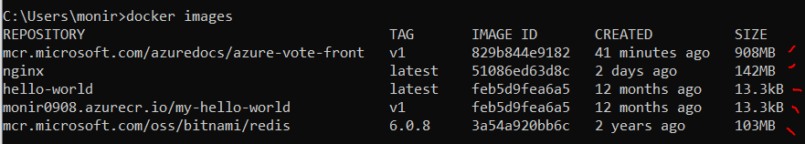
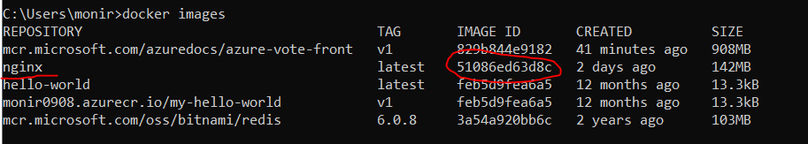
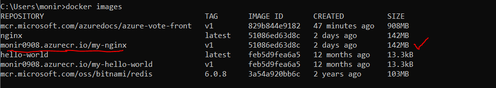
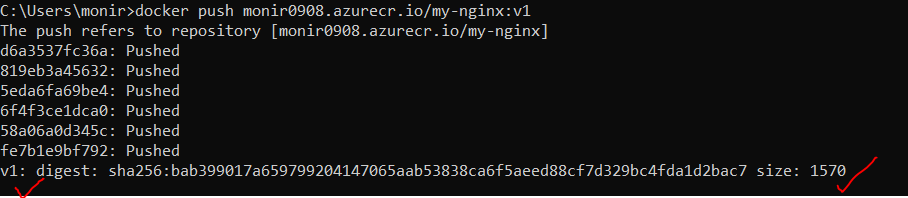
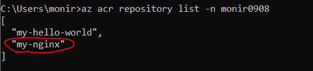

# Azure_ACR

### Step 01<hr>
Go to Azure Portal and create a container registry (e.g. registry name as: monir0908). <br>
Once the deployment is successful, it will provide us the following:<br>

<b>Login server:</b> monir0908.azurecr.io <br> 

We will need this `login server` later.

### Step 02<hr>
I am assuming we have `azure cli` installed. If yes, then type:<br>

```
az login
```

To login to the `acr`
```
az acr login -n monir0908
```

To chek the list of images we have in our `acr`
```
az acr repository list -n monir0908
```

### Step 03<hr>
To check the list of images stored in your machine

```
docker images
```

Now, it is displaying all the images stroed in our local machine. 
We have 5 images in our local machine. Let's pick `nginx` image for pushing it to the `acr`.<br>




We need the `IMAGE ID` of the `nginx` image. Let's copy the `IMAGE ID` of `nginx` image. In our case it is `51086ed63d8c`.<br>


### Step 04<hr>
To tag a image:<br>

`docker tag <image_id_that_we_want_to_push> <acr_login_server> / <any_name> : <version>`

```
docker tag 51086ed63d8c monir0908.azurecr.io/my-nginx:v1
```

Let's run the follwing command to see if `image tagging` worked:
```
docker images
```

It should display our tagged version of image with other images available:




### Step 05<hr>
To push the image to `acr`:
```
docker push monir0908.azurecr.io/my-nginx:v1
```

It will start pushing it to the `acr` and show the following when done.




Now, we can check if the repo <b>(i.e. my-nginx)</b> can be found in our registry list in `acr`.
To check:

```
az acr repository list -n monir0908
```

It is showing our expected image <b>(i.e. my-nginx)</b> in the list.




Thank you!!
